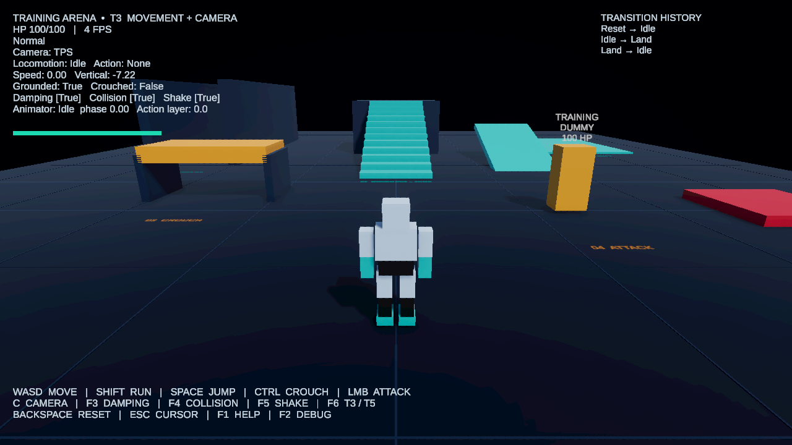

# Kết quả build và chạy thử

- Unity Editor: `6000.3.23f1` (Unity 6.3 LTS); project URP.
- Build Linux x86_64: T3 và T5 đều `Succeeded`; mỗi thư mục khoảng 99 MB.
- Đã khởi chạy cả hai executable với Xvfb 1280×720/OpenGL và chạy bộ kiểm tra tích hợp độc lập: **T3 30/30, T5 30/30**. Log runtime không có exception. Bộ kiểm tra đi qua trạng thái T3/T5 được cấu hình, controller/animation Generic, hai Humanoid Avatar, muscle retargeting, di chuyển/chạy/nhảy/Fall/Land, crouch và ceiling check, Animation Event/combat, bẫy Hit/Dead, reset, ba camera mode, fixed-camera zone, leo bậc thang và tránh vật cản camera.
- Xvfb dùng software rendering. Tốc độ hình ảnh của lần chạy Xvfb không đại diện hiệu năng trên máy chạy game có GPU thật.
- Build lưu ở `Builds/T3/TrainingArena` và `Builds/T5/TrainingArena`. Mã tạo build nằm trong `Assets/Editor/ProjectBootstrap/ArenaBuilder.cs`; báo cáo máy có danh sách từng assertion tại `Verification-T3.json` và `Verification-T5.json`.

## Ảnh runtime

## Giới hạn có chủ đích

Nhân vật chính là robot Generic procedural với 10 clip. Khu riêng minh họa hai Humanoid Avatar hợp lệ dùng cùng controller và muscle clips để retarget giữa tỉ lệ cơ thể. Project không chứa FBX/Mixamo.

P2 chưa triển khai: coyote time/jump buffer, nhân vật so sánh Rigidbody, Root Motion và strafe Blend Tree 2D. Gamepad có binding cho di chuyển/nhảy nhưng chưa được nghiệm thu end-to-end. Hai executable được build/kiểm tra trên Linux x86_64; chưa build Windows/macOS/Android.

## Phụ thuộc Unity MCP

UPM ghim Unity MCP tại `v10.0.0`; repo không commit công cụ uv/uvx trong `Tools/uv/`. Trên máy phát triển hiện tại uvx đã được cài trong thư mục đó (Git ignore) và server MCP chạy tại `http://localhost:8080/mcp`. Máy clone khác cần cài uv/uvx và khởi động MCP server trước khi dùng package.
